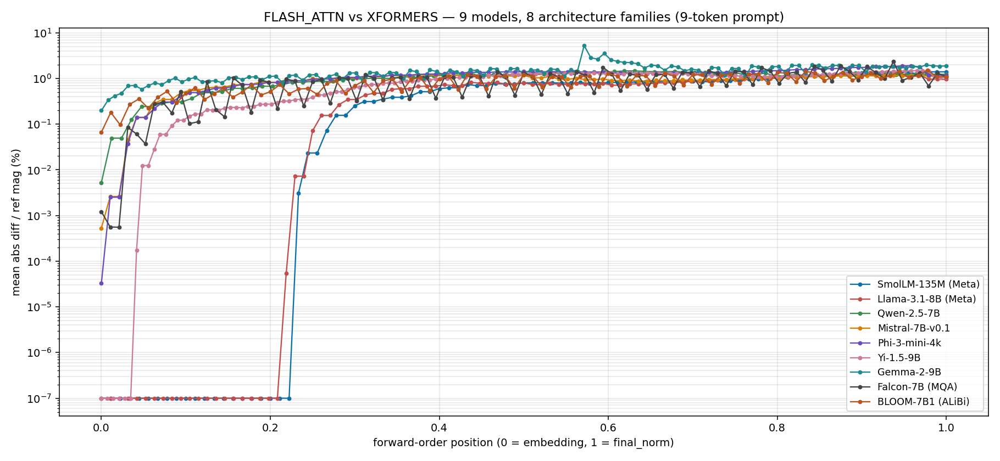
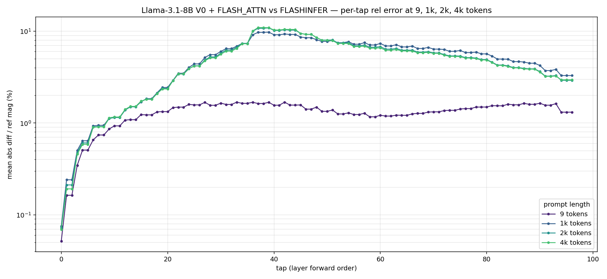
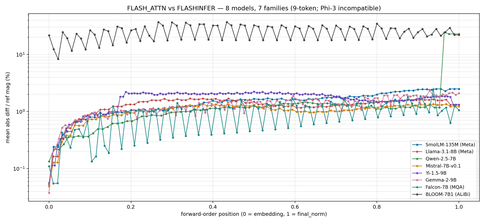
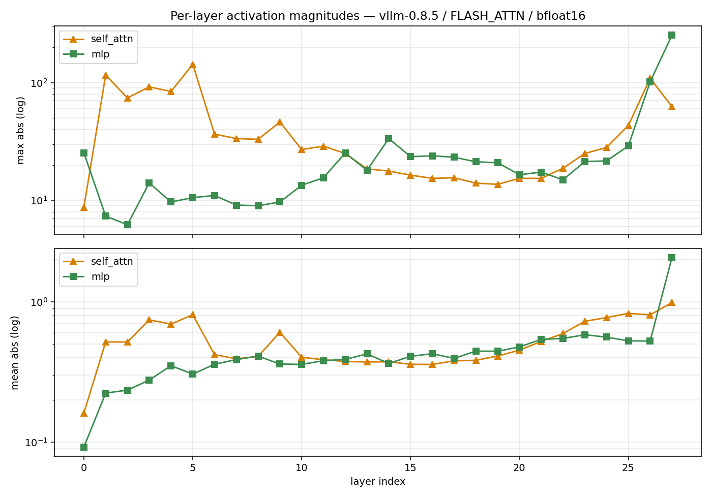

# Per-layer activation diffs against vLLM

Here's a small tool **[Firefly][repo]** that
diffs a candidate ML model's per-layer activations against a calibrated
reference and tells you the first layer where they disagree. The intended
use case is a CI gate: you point it at your model on every PR and it
fails loud if the residual stream moves.

This post mainly discusses what happens when you run it against vLLM on some models.

The most useful finding, before any setup:

> **vLLM 0.8.5 V0 → V1 is bit-equal at 9-token prompts and diverges at
> every single layer past the first PagedAttention block boundary**,
> with the *exact same attention kernel on both sides.* On
> Llama-3.1-8B, divergence saturates at ~2.8% final-layer relative
> error from 1k tokens through 4k tokens — it's a step function, not
> a slope. A unit test that uses short prompts would pass this
> comparison. Production would silently change.


The rest of this post is how I got here.

*(Related: the same per-layer machinery now drives [attribution-guided
mixed-precision quantization](quant-recipe.html) — which layers to keep in high
precision when you quantize, measured and verified.)*

## What's Firefly

It's a CLI plus a GitHub Action wrapper. The model is:

1. Register **forward hooks** on every decoder layer's `self_attn`, `mlp`,
   and residual-stream outputs (plus `final_norm`). For a 30-layer model
   that's 91 "tap points."
2. Run the model on a fixed batch of golden inputs and stash each tap's
   output tensor to disk in a `weights.safetensors` + `manifest.json`
   reference dir. That's the **reference**.
3. To check a candidate, run the candidate against the same inputs, diff
   per-tap, and walk the results in forward order to attribute the
   *first* tap where the diff exceeds a calibrated tolerance. That's the
   "first divergence" — actionable in a way `eval_score = 0.87 → 0.83`
   isn't.

The architecture is intentionally boring. The capture, diff, and
attribution modules are pure functions; the orchestrators wrap them with
the model-loading and file-I/O. There's no fully fledged online inference layer (yet), no
hosted dashboard (yet), no novel ML (yet). The interesting part is the picks:

- **Hook at the module boundary, not inside.** vLLM and HF transformers
  both expose `model.layers[i].self_attn` as a top-level submodule. Even
  though their internals differ (vLLM fuses QKV into one Linear, HF keeps
  them separate), the module-level *output* is a tensor of the same
  shape. We tap there.
- **Calibrate the noise floor empirically.** Every tap gets its own
  tolerance derived from re-running the reference 8 times. Flat
  thresholds are wrong in both directions — too tight on noisy taps,
  too loose on quiet ones.
- **One forward-ordered list drives everything.** The tap selector
  returns layer 0's `self_attn`, then `mlp`, then layer 0 residual, then
  layer 1's `self_attn`, ... etc. The capture loop, the diff loop, and
  the first-divergence walk all iterate this same list. "First
  divergence" semantics fall out for free.

## The setup I tested against

Everything below is **SmolLM-135M in BF16 on an NVIDIA A10G**, prompt =
`"the quick brown fox jumps over the lazy dog"` unless noted. Captures
ran on Modal. vLLM 0.8.5 with `enforce_eager=True` (to keep forward
hooks working; CUDA graphs would skip them).

The reason for `enforce_eager=True` deserves a flag: in eager mode, hooks
work because every forward op is dispatched through the Python
interpreter. With CUDA graphs enabled — which is what production vLLM
actually runs — hooks would force graph breaks. So the measurements in
this post are a **CI-time diagnostic**: Firefly spins up its own
eager-mode vLLM, captures, and tears it down. That's fine for a
per-PR check, where nobody's watching the latency.

Capturing against *live* production traffic is a different constraint —
you can't ask a serving stack to drop CUDA graphs and torch.compile.
That path needs a custom op that Dynamo treats as opaque
(tensor-in/tensor-out) so it survives compilation, plus something that
survives CUDA-graph replay, where there's no Python callback to hang a
hook on at all. Both of those now exist in the repo
(`firefly.shadow`): `torch.ops.firefly.capture` for the
eager/`torch.compile` path, and a Triton-kernel custom op
(`capture_static`) that writes stats into a pre-allocated GPU buffer
whose pointers get captured into the graph and re-run on every replay.
They're validated by spikes and a Modal integration test, but the shadow
*mechanism* has never been run against a live production model — that
online plumbing is the part that isn't built. (Offline capture *from* a
serving engine is wired and used heavily below: `firefly check --runner
{vllm,sglang}`. The unbuilt part is shadowing a model that's serving real
traffic.) The findings below all use the eager-mode hook path.

## The matrix

I ran 7 paired comparisons across the standard vLLM knobs — version,
engine, attention backend, prompt length, decode mode, batch size. The
short summary:

| Comparison | Result |
|---|---|
| 0.7.3 V0 vs 0.8.5 V0, auto backend | bit-equal |
| 0.8.5 V0 vs V1, auto backend | bit-equal |
| 0.8.5 V0 vs V1, FLASH_ATTN | bit-equal |
| 0.8.5 V0, FLASH_ATTN vs XFORMERS | **diverges, first at `layer.7.self_attn`** |
| Multi-request, V0 vs V1 (2 prompts) | shape mismatch (V0 packs, V1 doesn't) |
| **V0 vs V1, FLASH_ATTN, 300 tokens** | **diverges at every tap, first at `layer.0.self_attn`** |
| FLASH_ATTN vs XFORMERS, 8 decode tokens | **diverges everywhere, first at `layer.0.self_attn@token_0`** |

Three of these are real findings worth unpacking.

## Finding 1: Different attention kernels → first divergence at `layer.7.self_attn`

Same model, same vLLM, same hardware, same prompt. Only difference:
`VLLM_ATTENTION_BACKEND=FLASH_ATTN` versus `XFORMERS`. Both are correct
implementations of scaled dot-product attention; they use different
reduction orders for the matmul.


Layers 0–6 are bit-equal. Then at layer 7, the divergence cuts in
sharply — `layer.7.self_attn` is the first non-zero tap, and from there
relative error climbs through the residual stream to 1.4% by the final
LayerNorm. The shape of the curve is the textbook
"compounding-rounding-error" pattern in a deep network.

The interesting part isn't that this happens — anyone who has worked
on numerical kernels expects different reduction orders to round
differently in low-precision. The interesting part is **why divergence
starts at layer 7 specifically, not layer 0.**

Both backends produce different intermediate values starting at layer 0.
But at low activation magnitudes (early layers), BF16's 7-bit mantissa
rounds those tiny differences to the same representable value. Around
layer 7 of SmolLM-135M, residual-stream magnitudes have grown enough
(this is the activation-magnitude phase transition Dettmers et al.
documented in [LLM.int8()][dettmers]) that the kernel-level differences
cross the BF16 representable threshold.

So "first divergence at layer 7" is really *"first layer where the
kernel-rounding difference exceeds the precision representable
threshold."* Firefly is correctly attributing to a *coupling of three
things* — kernel difference × activation magnitude × precision-format
floor.

I expected the boundary to move on a model with larger early-layer
activations. The next section is the experiment I ran to test that
prediction, and the result that made me rewrite this paragraph.

## Finding 1.5: The layer-7 finding survives 60× model scale — and breaks at the family boundary

I expected the layer-7 boundary to shift on a much bigger model, so I
ran two stress tests of Finding 1's mechanism:

**Within-family stress test (model scale).** Same comparison, swap the
model from SmolLM-135M to `meta-llama/Llama-3.1-8B` on an A100-40GB —
same vLLM 0.8.5 V0, same BF16, same 10-token prompt. **First divergence
held at `layer.7.self_attn` on a 60× larger model with a 7× wider
residual stream.** Same layer index, similar fraction of taps
diverging, similar overall curve shape:


|  | SmolLM-135M | Llama-3.1-8B |
| --- | --- | --- |
| first divergent tap | `layer.7.self_attn` | `layer.7.self_attn` |
| taps diverging | 70/91 (77%) | 76/97 (78%) |
| final-norm relative error | ~1.4% | ~0.96% |
| hidden dim | 576 | 4096 |
| layers | 30 | 32 |

I was about to declare the layer-7 boundary universal. But then the
cross-family check broke it.

**Cross-family stress test (7 more models, 7 more families).** Same
comparison, swap the model again — to `Qwen/Qwen2.5-7B`,
`mistralai/Mistral-7B-v0.1`, `microsoft/Phi-3-mini-4k-instruct`,
`01-ai/Yi-1.5-9B`, `google/gemma-2-9b`, `tiiuae/falcon-7b`, and
`bigscience/bloom-7b1`. The last two test architectural axes none of
the earlier models had: **Falcon uses multi-query attention** (single
KV head shared across all query heads) and **BLOOM uses ALiBi
positional encoding** (per-position bias added to attention scores)
rather than RoPE:



|  model | first divergent tap | layer-0 rel error | final-norm rel error |
| --- | --- | --- | --- |
| SmolLM-135M (Meta) | `layer.7.self_attn` | ~0% (bit-equal) | 1.4% |
| Llama-3.1-8B (Meta) | `layer.7.self_attn` | ~0% (bit-equal) | 0.96% |
| **Qwen-2.5-7B** | **`layer.0.self_attn`** | 0.0052% | 1.23% |
| **Mistral-7B-v0.1** | **`layer.0.self_attn`** | 0.0005% | 1.12% |
| **Phi-3-mini-4k** | **`layer.0.self_attn`** | ≈0.00005% | 1.18% |
| **Yi-1.5-9B** | **`layer.2.self_attn`** | ~0% (bit-equal) | 1.06% |
| **Gemma-2-9B** | **`layer.0.self_attn`** | 0.1979% | 1.89% |
| **Falcon-7B (MQA)** | **`layer.0.self_attn`** | 0.0012% | 1.09% |
| **BLOOM-7B1 (ALiBi)** | **`layer.0.self_attn`** | 0.0663% | 1.08% |

Five things stand out:

1. **The layer-7 universality is real *within the Meta architecture
   lineage* (SmolLM, Llama-3) and breaks at every other family.**
   Six of seven non-Meta models shift to layer 0 with FLASH vs XFORMERS.
2. **Yi-1.5-9B remains the lone outlier at layer 2** — neither 0
   nor 7. With Falcon and BLOOM landing at layer 0 alongside Qwen /
   Mistral / Phi-3 / Gemma-2, the pattern isn't even a clean
   "Meta-vs-not" dichotomy; it's per-family.
3. **Architecture features that *don't* matter for the
   first-divergence layer:** Falcon's MQA (single KV head) and BLOOM's
   ALiBi (no RoPE at all) both land at the same `layer.0.self_attn`
   as the GQA-with-RoPE non-Meta models. The earlier "vLLM XFORMERS
   dispatches differently per RoPE config" hypothesis is partially
   refuted by BLOOM — no RoPE, still layer 0.
4. **Gemma-2's layer-0 rel error is the largest by ~40×** — 0.1979%
   vs Qwen's 0.0052%. Likely because Gemma-2 uses hybrid sliding-window
   + full attention, so XFORMERS and FLASH_ATTN dispatch through very
   different code paths even at the first attention layer.
5. **Final-norm relative errors all fall in a 1.0%–1.9% band.** Where
   the divergence *starts* varies by family, but the *aggregate* drift
   by the final layer-norm doesn't.

The most likely driver of the family-level variation is a
vLLM-internal-dispatch effect. vLLM's XFORMERS backend takes different
code paths depending on the model's RoPE configuration — Llama-3.1
uses `theta=500000` with rope_scaling; Qwen2.5 uses `theta=1000000`;
Mistral uses `theta=10000`; Yi-1.5 uses a different rope_scaling
factor. Different inverse-frequency tables get computed and reduced
differently, and BF16 rounding surfaces the difference at the first
attention layer rather than waiting for activation magnitudes to grow.

**Corrected framing.** Finding 1's mechanism (kernel-diff × activation
magnitude × precision threshold) is the right intuition. The original
prediction "layer-7 will shift on larger models" was wrong about the
*scale* dimension and right about there being *some* model-dependent
dimension — I just had the wrong dimension in mind. The honest version
of the universality claim:

- **Within an architecture family** (Meta-Llama lineage tested):
  first-divergence layer is universal across model scale. Two
  data points (SmolLM-135M, Llama-3.1-8B); the layer-7 boundary
  is stable.
- **Across architecture families**: first-divergence layer
  shifts, and the shift isn't even uniform. Seven more data points
  (Qwen-2.5, Mistral-7B, Phi-3-mini, Yi-1.5-9B, Gemma-2-9B,
  Falcon-7B, BLOOM-7B1) — six land at layer 0, one (Yi) at layer 2.
  This holds for ALiBi (BLOOM, no RoPE) and MQA (Falcon, single
  KV head) as well as the more typical RoPE+GQA setups.
- The *mechanism* of "Firefly's per-layer attribution points at the
  first BF16-visible difference" is unchanged. What that layer
  index *is* depends on the architecture-family-specific kernel
  dispatch.

That's a less ambitious universality claim than I led with, but it's
the claim the data actually supports. Forward-pointer: Finding 4 will
return to this with FLASHINFER, where the layer-0 finding turns out to
hold across *all eight* supported models that can use FLASHINFER (one
model can't, for an architectural reason that's its own finding) —
different kernel pair, much more robust universality.

## Finding 2: Decode capture exposes that layer 0 itself diverges

Same FLASH_ATTN vs XFORMERS comparison, but now I let the model generate
7 additional tokens after the prompt and captured activations at each
decode step. Tap names get suffixed: `layer.7.self_attn@prefill` for the
prompt forward, `layer.7.self_attn@token_0..token_6` for each decode
step.


Three things happen at once in this plot:

1. **Prefill (dark purple, bottom):** the familiar layer-7 onset story.
   Layers 0–6 bit-equal, sharp jump at 7, climbs to ~1.4% by
   `final_norm`. This is what we already had.

2. **token_0 (just above prefill):** *every layer* now diverges,
   including `layer.0.self_attn`. That's the surprise — in prefill,
   layer 0 was bit-equal. I want to be careful about the mechanism
   here, because the obvious story ("the KV cache carries divergence
   into layer 0") is wrong: each layer attends over *its own* KV
   cache, and layer 0's prefill cache was bit-equal between the two
   backends. What actually changes at decode is the attention *path* —
   FlashAttention and xFormers both special-case single-query decode
   with a different kernel than prefill, so the rounding that stayed
   sub-threshold at layer 0 in prefill need not stay sub-threshold in
   the decode kernel. (A second possible contributor I haven't isolated:
   under a 1.4%-divergent final logit, greedy decoding could pick a
   different token on one side, which would change layer 0's input
   outright.) The honest, evidence-backed claim is the observation
   itself: **there is no "layer 0 starts clean" regime once you're
   decoding.**

3. **token_1 through token_6 (stacked progressively higher):** each
   successive curve sits above the last. This part *is* a cache-
   accumulation effect — but within a layer, not across layers: once a
   layer's self-attn output diverges at a decode step, that position's
   K/V at *that same layer* is now divergent, so later tokens attending
   over it read progressively more-divergent cached state. By token 6,
   `final_norm` is at 3.7% relative error, up from 1.4% at prefill.

In forward order with the unified tap naming (prefill first, then
token_0, token_1, ... per tap), the *first* divergent tap is
**`layer.0.self_attn@token_0`**, not `layer.7.self_attn` as it is in
prefill-only mode. Decode is simply a harsher regime: the masking that
kept early layers bit-equal in prefill doesn't hold once the decode
attention path is in play.

This shows that output-level monitoring is insufficient. The final-LayerNorm
rescales by ~50× by the end of the network — output drift is *small
percent-of-scale*. An eval that thresholds at 1% accuracy delta passes
this comparison at token 0 and might keep passing for 50 tokens before
the accumulated drift crosses the threshold.

## Finding 3: The same engine swap that's safe at 9 tokens is broken at 1k — and stays broken

This is the plot at the top of the post.

Same vLLM 0.8.5. Same FLASH_ATTN. Only difference: the V0 engine vs the
V1 engine. I ran the comparison at four prompt lengths on
Llama-3.1-8B (A100-40GB, BF16):

| prompt length | taps diverging | first divergence | final-norm rel error |
| --- | --- | --- | --- |
| 9 tokens | **0 / 97** (bit-equal) | — | 0% |
| 1k tokens | 97 / 97 | `layer.0.self_attn` | **2.84%** |
| 2k tokens | 97 / 97 | `layer.0.self_attn` | **2.62%** |
| 4k tokens | 97 / 97 | `layer.0.self_attn` | **2.86%** |

I expected "monotonically growing with length." That's not what
happens. **The curve is a step function**: bit-equal at very short
prompts, immediately maxed-out divergence past the first PagedAttention
block boundary, and roughly flat from 1k tokens onward. Length isn't
the threshold; block-count is.

Why? V0 uses flat attention — compute the full $QK^T \to \text{softmax}
\to V$ product in one go. V1 uses PagedAttention, which is vLLM's
marquee feature: the KV cache is sharded into 16-token blocks, attention
is computed block-by-block, and an online-softmax merge stitches the
per-block scores back together. The math is *equivalent*. The reduction
order is *different*. BF16 makes the difference visible.

At 9 tokens, only one block is involved. Single-block PagedAttention is
arithmetically identical to flat attention — same reduction order, same
bit pattern. At 1k tokens, 60+ block boundaries are crossed and the
online-softmax merge has accumulated enough rounding error that *every*
tap is past tolerance. Crossing from 1k to 4k adds more block
boundaries but the per-element error from the merge is already
saturated.

The implication is:

- **Short-prompt unit tests pass.** Anyone testing their vLLM upgrade
  with the typical 8-to-30-token prompts you find in test fixtures
  would see "V0 → V1 is bit-equal" and call the upgrade safe.
- **Any realistic production prompt is in the divergent regime.** 1k
  tokens is below most production prompt lengths. Whatever length you
  test at past the block boundary, you see the same ~2.8% final-norm
  drift.
- **The kernel is literally identical.** This is not a kernel-swap bug;
  it's a *blocking strategy* bug. The argument "FLASH_ATTN on V0 and
  FLASH_ATTN on V1 are doing the same math" turns out to be true only
  at trivially-short context — below the block-boundary threshold.

A CI gate should catch this — quietly,
automatically, before deploy. A short-prompt unit test would not. A
benchmark eval might or might not, depending on how sensitive the eval
metric is to ~3% absolute internal drift that final_norm rescales down.

## Finding 4: FLASHINFER diverges at layer 0 — and its error grows with length

vLLM ships three attention backends — FLASH_ATTN, XFORMERS, and
FLASHINFER. FLASHINFER is the one production stacks at Together,
Fireworks, and DeepSeek actually use, because its split-K
parallelization beats FlashAttention 2 for single-query decode.
Getting it installed on Modal was tricky — `flashinfer-python` on
PyPI is a stub requiring a CUDA-specific wheel; attempts on
`debian_slim` failed with "CUDA_HOME not set", on the
`vllm/vllm-openai` Docker image with a Python 3.12 aiohttp ABI
collision, and finally worked on a clean `nvidia/cuda` devel base
with explicit pip-install of vLLM and flashinfer.

Once it was working, the result:



| length | first divergent tap | layer-0 rel | final-norm rel |
| --- | --- | --- | --- |
| 9 tokens | `layer.0.self_attn` | 0.0516% | 1.31% |
| 1k tokens | `layer.0.self_attn` | 0.0749% | 3.29% |
| 2k tokens | `layer.0.self_attn` | 0.0722% | **2.92%** |
| 4k tokens | `layer.0.self_attn` | 0.0693% | **2.96%** |

Two new things relative to the earlier findings:

**1. Layer 0, not layer 7 — and this one really is universal across
families.** The FLASHINFER vs FLASH_ATTN per-element kernel-difference
is much larger than XFORMERS vs FLASH_ATTN's: ~0.05% relative at layer
0 versus ~0.0001% at layer 0 for XFORMERS. The bigger per-element diff
crosses BF16's representable threshold *immediately* in early-layer
activations. In contrast to the XFORMERS layer-7 finding that broke at
the family boundary, the FLASHINFER layer-0 finding holds across all
eight models I tested that can run FLASHINFER — covering Meta, Qwen,
Mistral, 01.AI, Google, TII (Falcon, MQA), and BigScience (BLOOM,
ALiBi) architecture lineages:



| model | first divergent tap | layer-0 rel | final-norm rel |
| --- | --- | --- | --- |
| SmolLM-135M (Meta) | `layer.0.self_attn` | 0.0519% | 2.49% |
| Llama-3.1-8B (Meta) | `layer.0.self_attn` | 0.0516% | 1.31% |
| Qwen-2.5-7B | `layer.0.self_attn` | 0.1332% | **22.83%** |
| Mistral-7B-v0.1 | `layer.0.self_attn` | 0.0489% | 1.23% |
| Yi-1.5-9B | `layer.0.self_attn` | 0.0562% | 1.32% |
| Gemma-2-9B | `layer.0.self_attn` | 0.0380% | 2.09% |
| Falcon-7B (MQA) | `layer.0.self_attn` | 0.1104% | 1.06% |
| BLOOM-7B1 (ALiBi) | `layer.0.self_attn` | **21.59%** | **22.00%** |

So the kernel-pair-determines-the-divergence-layer story has *some*
universal claims and some less-universal ones. FLASHINFER's per-element
diff is large enough to cross the BF16 threshold at layer 0 regardless
of family-specific dispatch differences; XFORMERS's smaller per-element
diff is sensitive to those differences.

Two of the eight final-norm numbers are outliers: Qwen at 22.83% and
BLOOM at 22.00%. They're not the universal story, and they have
mechanistically *different* failure modes — that's Finding 5 below.

**A separate FLASHINFER finding worth flagging.** When I tried to run
the same comparison on Microsoft's `Phi-3-mini-4k-instruct`, vLLM
init failed before any forward pass:

```
ValueError: Only [64, 128, 256] are supported for head_dim, received 96.
```

Phi-3-mini uses `head_dim=96`, which FLASHINFER's kernels don't
support. **FLASHINFER isn't a drop-in replacement for every supported
vLLM model**, regardless of numerical drift. For a production stack
that needs to serve Phi-3-class architectures, this constraint is more
load-bearing than the layer-0 numerical drift finding.

**2. The length curve is *also* a step-up-then-plateau, just at a
higher plateau than V0 vs V1.** I initially thought FLASHINFER's
length curve was monotonic (the original 9 → 1k jump was 2.5×, which
read like growth in progress). Adding 2k and 4k tokens shows the
plateau: 1k = 3.29%, 2k = 2.92%, 4k = 2.96%. The 1k number is even
slightly higher than 2k and 4k — measurement noise within the
saturated regime, not a trend.

So both length curves saturate past ~1k tokens — they just saturate
at different *heights*:

| | 9 tokens | 1k+ plateau |
| --- | --- | --- |
| V0 vs V1, same FLASH_ATTN | bit-equal | ~2.8% |
| FLASH_ATTN vs FLASHINFER | **1.31%** | **~3.0%** |

The explanation matches: FLASHINFER has two superimposed sources of
difference:

- A constant kernel-level reduction-order diff (visible at 9 tokens,
  baseline ~1.3% final). V0 vs V1 doesn't have this — same kernel.
- A length-dependent paging diff that compounds once you cross the
  first PagedAttention block boundary, then saturates because the
  per-block error doesn't keep compounding to first order. This is
  the same mechanism V0 vs V1 has, at the same plateau height
  (~1.6-1.7% of additional final-norm rel).

**Synthesis.** Firefly's per-layer attribution distinguishes three
distinct failure modes that all look like "model output drifted" at
the eval level:

| failure mode | example | first divergent tap | length curve |
| --- | --- | --- | --- |
| kernel reduction-order (small) | FLASH vs XFORMERS | `layer.7.self_attn` (Meta) / `layer.0` or `layer.2` (others) | unknown |
| kernel reduction-order (large) | FLASH vs FLASHINFER | `layer.0.self_attn` | step-up to ~3% then plateau |
| blocking strategy | V0 vs V1, same kernel | bit-equal short, `layer.0.self_attn` long | step-up to ~2.8% then plateau |

Same attribution tool, three different signatures. Useful in
production: an SRE seeing "Firefly says first divergence is
layer.0.self_attn and the rel error grew between 1k and 4k" knows the
kernel itself changed; "first divergence is layer.7" knows it's a
subtler kernel swap; "bit-equal at short and divergent at long" knows
it's a blocking-strategy change.

## Finding 5: FLASHINFER has two catastrophic-divergence regimes — one Qwen-shaped and one BLOOM-shaped

The Qwen and BLOOM final-norm numbers from Finding 4 (22.83% and
22.00%) are *both* ~20× outliers vs the other six models. They look
similar in magnitude. They are not the same mechanism.

### The Qwen regime: late-layer outlier-feature spike

The Qwen 22.83% is *not* a distributed-everywhere-large-error
situation. It's a single-layer catastrophic spike. Through layers
0-26, Qwen FLASHINFER vs FLASH_ATTN tracks the other models —
gradually climbing from ~0.13% at layer 0 to ~1.2% by layer 26,
almost identical to Mistral's curve. Then layer 27 happens:

| layer | Qwen rel error | Qwen `mean(\|activation\|)` |
| --- | --- | --- |
| 26 | 1.17% | 0.526 |
| **27.self_attn** | **24.31%** | **0.989** |
| **27.mlp** | **22.83%** | **2.066** |
| final_norm | 22.83% | 2.066 |

A 20× jump in relative error in one layer. Qwen-2.5-7B has 28 layers
(indexed 0-27), so layer 27 is its *final transformer block*. Mistral
(32 layers, last index 31) has no analogous jump — its final layer
sits at 1.35%. So this is not "last layer of anything" — it's
specifically Qwen.

Looking at the activation magnitudes plot for Qwen:



Qwen's MLP outputs peak at a `max(|activation|)` of **252** — the
largest outlier-feature magnitudes in any model I tested (Llama tops
out at 40, SmolLM at 13). Crucially, the concentration is in the
*late* layers. Mistral has similar peak magnitudes (~176), but they
ramp up gradually across 32 layers; Qwen front-loads its outliers into
the final 1-2 layers.

The interaction is plausibly: FLASHINFER's larger per-element
reduction-order difference (visible from layer 0) compounds gradually
through the network. At Qwen's layer 27, where the activation
magnitudes jump 4× from layer 26, the per-element diff suddenly has 4×
more headroom to manifest in absolute terms — and the relative error
spikes 20×.

Finding 6's per-head instrument notes that the
real mechanism is a discrete kernel behavior, not amplified rounding.
The hypothesis-as-written is preserved here because the correction is
the point; skip ahead to the end of Finding 6 for what's actually
happening.

This is the kind of finding a Qwen-on-FLASHINFER serving stack would
want to know about. The model's output drift in BF16 with FLASHINFER
is a specific, localized, mechanistic issue concentrated in one layer
— not a broad model-wide degradation. An eval that looks at
final-output similarity would say "Qwen on FLASHINFER is meaningfully
different from Qwen on FLASH_ATTN" with no further attribution.
Firefly's per-layer attribution localizes it to `layer.27` and shows
its mechanism (magnitude × kernel-diff overshoot) in one plot.

Re-running the Qwen FLASHINFER capture from scratch produces
bit-identical per-tap activations and the same 22.83% final-norm
number to four decimal places — Firefly's deterministic capture path
makes the result a stable diagnostic, not a noisy measurement. And
the catastrophic spike is *Qwen-specific*: Mistral-7B and Yi-1.5-9B
both have similar peak activation magnitudes but no final-layer
spike, because they spread their outlier features across more layers
rather than concentrating them in the final 1-2.

I wasn't certain it was a *bug* — it could have been the BF16-correct
behavior given Qwen's outlier-feature concentration at the final
layer. However, the per-head result at the end of Finding 6 shows that
exact-zero head outputs are not a rounding regime. Either way the
diagnostic flow that surfaced it (swap one knob, run one Firefly
check, look at the per-layer curve, then drill per-head) is what this tool is for.

### The BLOOM regime: kernel-fundamental divergence from layer 0

BLOOM's 22.00% looks superficially similar to Qwen's 22.83% — both
are ~20× outliers, both surface with FLASHINFER. But the per-tap
curve tells a different story: BLOOM hits its catastrophic regime
*immediately at layer 0* (`layer.0.self_attn` is already at 21.59%
rel error), and the curve stays flat at ~22% across every layer
through final_norm. There's no gradual climb, no late-layer spike,
no per-layer mechanism to point at. The kernel is just wrong from
the first attention call.

The plausible explanation: BLOOM uses ALiBi positional encoding —
attention scores get a position-dependent bias added in instead of
having Q/K rotated by RoPE. FLASHINFER's attention kernels are
optimized around RoPE-first models; if its ALiBi path isn't
hand-tuned (or falls back to a generic implementation) and accumulates
the bias in a different precision than FLASH_ATTN does, the
per-element difference is large enough that even a single-token
prompt produces a 22% relative error at the first attention.

The takeaway for the diagnostic story: Firefly's per-layer attribution
*also* distinguishes the two catastrophic regimes from each other,
even though they show up at the same final-norm aggregate magnitude.
A production observability dashboard that gates on output similarity
would lump the two together; per-layer attribution shows that one is
a localized late-layer issue solvable by skipping FLASHINFER on
Qwen-specifically, and the other is a kernel-wide ALiBi-vs-FLASH_ATTN
mismatch that affects every BLOOM-class deployment uniformly.

For a production stack picking attention backends, **the practical
implication is "FLASHINFER is not a drop-in for ALiBi-positional
models in BF16."** It's an architectural mismatch, not a per-model
quirk.

## Finding 6: The kernel divergence starts at exactly *one* attention head — at any model scale

Everything above attributes divergence to a *layer*. This pass drills
one level deeper: which attention *head* inside `layer.7.self_attn`
actually diverges first?

The mechanics first, because they constrain where you can look. You
can't recover per-head outputs from the attention block's output: the
output projection (`o_proj`) is a dense matmul that linearly mixes all
heads together. The only place per-head structure still exists is the
*input* to `o_proj` — the concatenated per-head context vectors. So
Firefly's `--per-head` mode taps there, splits the tensor into
`(n_heads, head_dim)`, and reports per-head max-diffs plus a
**concentration ratio**: worst head's diff over the median head's diff.
A high ratio means the divergence is localized to one head; ~1× means
it's everywhere.

Running FLASH_ATTN vs XFORMERS again with per-head taps:

| | bit-clean prefix | at layer 7 | heads diverging at layer 7 |
|---|---|---|---|
| SmolLM-135M (9 heads) | layers 0–6 | head **2**, max\|Δ\| 1.95e-03 | **exactly 1 of 9** |
| Llama-3.1-8B (32 heads) | layers 0–6 | head **30**, max\|Δ\| 6.10e-05 | **exactly 1 of 32** |

That's not "head 2 is the worst" — it's *every other head at layer 7 is
bit-identical between the two kernels.* One head cracks. By layer 8 the
divergence has entered the residual stream and smeared across all
heads (concentration drops to single digits), which is why layer-level
attribution sees a clean break at layer 7 but per-head attribution is
needed to see how surgical the break actually is.

The cross-scale replication is unexpected. Finding 1.5
established that the layer-7 *layer* boundary survives 60× model scale
within the Meta lineage. The per-head data says the *single-head-crack
pattern* survives too: on Llama-3.1-8B the first divergence is a few
elements of one head out of 32 (mean |Δ| at that tap: 1.5e-09 — the
max is 6.1e-05 concentrated in a couple of positions). The head
*index* is not conserved (2/9 vs 30/32), which fits the Finding 1
mechanism: whichever head carries the largest activation magnitudes
at layer 7 crosses the BF16 representability threshold first, and
which head that is depends on where the model happened to put its
outlier features.

And the FLASHINFER contrast makes the signature diagnostic. Running
FLASH_ATTN vs FLASHINFER per-head (both captured on the same
FLASHINFER-capable image, so the only variable is the backend):
**every head diverges from layer 0.** Worst head at layer 0 is
9.8e-04, the *median* head is 1.2e-04 — nonzero everywhere — and the
concentration ratio never exceeds ~9× anywhere in the network. No
bit-clean prefix, no single cracking head.

So the two divergence classes from Finding 4 now have distinct
per-head signatures:

| comparison | layer signature | per-head signature |
|---|---|---|
| FLASH vs XFORMERS | bit-equal until layer 7 | one head cracks (∞ concentration), then smears to single digits |
| FLASH vs FLASHINFER | diverges at layer 0 | all heads at once, uniformly (~1–9× everywhere) |

A debugging workflow can read this directly: high per-head
concentration at the first divergent layer means "a specific head's
numerics crossed a precision threshold" (think: outlier features,
magnitude-dependent rounding); flat concentration from layer 0 means
"the kernel itself computes differently for everything" (think:
different reduction order, different bias handling). Same tool, one
extra flag, and the diagnosis gets a mechanism attached.

### The Qwen payoff: the layer-27 spike is two silently zeroed heads

Then I pointed the per-head instrument at Finding 5's open question —
the Qwen-2.5-7B + FLASHINFER 20× spike at layer 27 — expecting to see
the outlier-feature head with elevated-but-continuous divergence, which
would have confirmed the "magnitude × kernel rounding" hypothesis.

That's not what the data says. Layers 0–26 show FLASHINFER's usual
uniform kernel signature (concentration 1.5–7.5×). At layer 27:

| layer.27 head | max\|Δ\| | head's own max\|activation\| (FLASH) | rel |
|---|---|---|---|
| **10** | **68.5** | **68.5** | **100%** |
| **13** | **68.5** | **68.5** | **100%** |
| 7 | 0.14 | 68.5 | 0.21% |
| 26 | 0.13 | 8.9 | 1.41% |
| (other 24 heads) | ≤0.094 | — | ≤3.9% |

Two heads at exactly 100% relative error, 26 heads at ordinary kernel
noise. And 100% isn't "very divergent" — checking the raw tensors:
**FLASHINFER outputs all-zeros for heads 10 and 13 of layer 27.** Every
token, every dimension, exactly 0.0. FLASH_ATTN produces real values
there (peaking at 68.5 — the largest activation anywhere in the
model, at the BOS token). Scanning all 784 (layer, head) pairs in the
network: these two are the *only* zeroed outputs, on either backend.

A softmax-weighted average of value vectors can't be exactly zero by
accident. This is a discrete kernel behavior — FLASHINFER's path is
dropping those two heads' outputs entirely — and o_proj then mixes the
missing contribution into every output channel, which is why the
layer-level view in Finding 5 showed a diffuse-looking 24% error
instead of two missing heads.

The structure around it is suggestive. Qwen-2.5-7B is GQA with 4 KV
heads (7 query heads per group). Heads 7–13 — the group sharing KV
head 1 — are exactly the heads whose outputs carry the model's massive
BOS-token activation (all seven peak at exactly 68.5, since they
share the same V and all sink on BOS). FLASHINFER zeroes two of those
seven. So the zeroing is co-located with the massive-activation
attention-sink structure, but magnitude alone doesn't determine it —
heads 7, 8, and 11 see the same 68.5 and survive. The trigger inside
the kernel is the remaining open question, and it's now sharp enough
to file upstream: *which code path in FLASHINFER's prefill kernel
returns a zero output row for these two specific (query-head,
KV-group-1) combinations on Qwen-2.5-7B at BF16?*

**It's a live bug, not a historical one.** I re-ran the pair on
current vLLM (0.22.1, V1 engine, which pins flashinfer-python
0.6.11.post2 — roughly two years of FlashInfer releases past the
0.2.x that vLLM 0.8.5 used): heads 10 and 13 of layer 27 are still
exactly zero, same two heads, FLASH_ATTN still fine. The repro now
spans two *completely different* vLLM integration layers — the
deleted V0 engine and the current V1 engine — which moves suspicion
firmly toward FlashInfer's own prefill path (or an invocation pattern
both vLLM generations share) rather than vLLM glue code.

That re-run came with a methodological trap worth recording: modern
vLLM **silently ignores** the `VLLM_ATTENTION_BACKEND` environment
variable (backend selection moved to an `attention_backend` engine
argument). My first "repro attempt" on 0.22.1 produced two
bit-identical captures — both had quietly run the default backend,
and a naive reading would have concluded "fixed upstream." The
capture harness now reads the attention implementation class off the
live model (`FlashAttentionImpl` vs `FlashInferImpl`) and refuses to
proceed when it doesn't match the request. If your comparison tooling
trusts its own knobs, the knobs will eventually lie to you; verify
the thing you're varying actually varied.

The hypothesis I wrote in Finding 5 was
a smooth-numerics story, and the per-head instrument built to test it
found a discrete bug-shaped behavior instead. That's a reasonable
argument for attribution tooling — each level of
attribution (layer → head → tensor) didn't just narrow the location,
it *changed the mechanism class* of the explanation.

## Finding 7: The reference artifact doubles as a quantization-risk map

This one isn't a divergence finding — it's a reuse of the data Firefly
already has. A reference artifact contains every tap's full activation
tensor. That's exactly the input you need to answer a different
question: **which layers will break if I quantize this model?**

`firefly quant-risk --reference <dir>` simulates symmetric
round-to-nearest int8 (or int4) quantization of each stored activation
twice — once with a single per-tensor scale, once with one scale per
channel — and reports the relative error of each, per tap. No model
run, no quantized weights; it's pure arithmetic on tensors you already
captured for parity checking.

One metric decision matters enough to flag: the error is computed
*within* each channel and then averaged across channels, not as a
single magnitude-weighted global mean. The failure mode this catches
is the whole point: when one channel is 1000× the others, a per-tensor
scale sized for the outlier rounds every *normal* channel to zero —
100% error on each of them — while a global error metric barely moves,
because the outlier channel dominates its numerator and denominator
alike. (My first implementation used the global metric; the unit test
for "one outlier channel" showed per-channel scaling only winning
3.7×, which was the metric hiding the damage, not the damage being
small.)

Running it on the SmolLM-135M FP32 reference from the earlier
validation work:

| tap | max\|activation\| | channel concentration | int8 per-tensor err | int8 per-channel err | gain |
|---|---|---|---|---|---|
| layer.9.mlp | 35.5 | 9.1× | 7.7% | 0.8% | 9× |
| layer.10.mlp | 49.7 | 9.3× | 5.3% | 0.5% | 11× |
| **layer.11.mlp** | **30,300** | **768×** | **98.0%** | **1.2%** | **81×** |
| layer.12 (residual) | 31,900 | 939× | 99.0% | 0.7% | 142× |
| layer.13 (residual) | 32,000 | 943× | 99.0% | 0.7% | 146× |

This is the layer-11 outlier-feature phase transition from the
validation findings — the same `max(|activation|)` jump from ~50 to
~30,000 in one layer that made TF32 noise spike there — now read out
as a quantization-risk statement: **per-tensor int8 at layer 11 puts
the average channel at 98% relative error — most channels round to
zero — and per-channel scaling recovers it to 1.2%.** The residual
stream stays in that regime through layer 27, exactly where the
magnitudes stay locked at ~32k.

First, it's a quantitative
re-derivation of *why* LLM.int8(), SmoothQuant, and every production
W8A8 scheme ended up outlier-aware — derived from one CLI command on
an artifact that was captured for a completely different purpose.
Second, it closes a loop within this post: Finding 1's mechanism
(kernel divergence surfaces where activation magnitudes cross the
BF16 threshold) and Finding 7's mechanism (quantization breaks where
activation magnitudes are outlier-concentrated) are the same
underlying object — the model's activation-magnitude profile — read
through two different failure modes. Capture it once, and both
diagnostics are queries against it.

This simulates round-to-nearest quantization of
activations in isolation. A real quantized serving stack has fused
dequant epilogues, weight quantization, and calibration data that
shift the picture. `quant-risk` is a *map of where to look*, not a
substitute for evaluating the quantized model.

## Takeaways

**Tolerance calibration is environment-sensitive.** Same-machine
calibration measures runs-on-this-machine variance; cross-machine FP
variation is a different (and often larger) noise distribution. A useful fix in the
product is a `--jitter-floor` that composes with the per-tap calibration —
it ignores relative drift below a set fraction of `max|ref|`, absorbing
cross-platform jitter (it can only loosen the gate, never tighten it). The
lesson: "calibrated tolerances" alone aren't portable; they need an
environment-stationarity escape hatch. And calibration only earns its keep
under real nondeterminism — on bit-deterministic CPU+fp32 it collapses to the
flat defaults, so a CPU-gated CI leans on the `--jitter-floor` ceiling and a
GPU-derived `tolerances.json`, not on CPU calibration.

**Per-layer attribution is important.** "Your eval dropped 2 points"
is extremely difficult to debug.
"`layer.7.self_attn` is the first divergent tap" points directly at the
attention kernel. The cost of producing this attribution is N forward
hooks and a sort — trivially cheap. The cost of *not* producing it
shows up every time someone debugs a serving-stack regression.

**Decode-step capture is required.** Prefill-only is the easy
case. Decode is where the production knobs (PagedAttention, scheduler,
spec decode) actually live, and it's where divergence compounds via KV
cache. Prefill-only tools
will miss most real upgrade-time bugs.

## Limitations

- **Nine models, eight architecture families.** Meta lineage
  (SmolLM-135M, Llama-3.1-8B), Qwen-2.5-7B, Mistral-7B-v0.1,
  Phi-3-mini-4k, Yi-1.5-9B, Gemma-2-9B, Falcon-7B (MQA + RoPE),
  BLOOM-7B1 (MHA + ALiBi). The XFORMERS layer-7 pattern is
  within-Meta only; non-Meta is layer 0 on 6 of 7 with Yi as the
  outlier at layer 2 — regardless of MQA vs GQA or RoPE vs ALiBi.
  FLASHINFER's layer-0 universality holds across all 8 models that
  can run FLASHINFER (Phi-3 hard-incompatible, head_dim=96; BLOOM
  runs but produces a 22% kernel-wide ALiBi mismatch).
- **One precision format primarily.** Most of my runs are BF16; the
  earlier validation work showed FP32 is bit-deterministic on the same
  setup, and FP16 behaves like BF16 from a reproducibility standpoint
  (different mantissa, same general pattern). Quantized regimes
  (INT8/INT4) would surface different failure modes — Finding 7
  *simulates* activation quantization from stored tensors, but real
  quantized kernels (fused dequant, weight quant, calibration) are
  untested territory.
- **One inference engine.** Firefly currently has a vLLM-specific
  capture path. SGLang and TGI would each need their own. The engine-
  internal differences (apply_model vs collective_rpc, etc.) are the
  per-engine engineering cost.
- **Live shadow capture is a built mechanism, not a proven product.**
  Every number in this post came from eager-mode CI capture (forward hooks
  can't survive CUDA graphs). The CUDA-graph-safe custom op for capturing
  against live compiled traffic exists in `firefly.shadow` and survives a
  synthetic compiled model, but two things are open: I haven't measured its
  per-token overhead (the first question any latency-sensitive team asks),
  and I haven't run it against a real serving deployment. It's also
  structurally limited to models you instrument yourself — vLLM and SGLang
  compile their own model code, so you can't inject the capture op into
  them. Honest status: a promising primitive, not a drop-in production
  monitor.

## Reproduce

The full repo is at **[github.com/neelvad/firefly][repo]**. To rerun the
matrix locally:

```sh
git clone https://github.com/neelvad/firefly && cd firefly
uv sync --all-extras
uv run python scripts/run_vllm_suite.py
```

The reference dirs for the V0/V1/FLASH_ATTN/XFORMERS combinations
referenced here aren't in the repo (they need a GPU to produce), but
`scripts/capture_vllm.py` is the script that produced each one and the
test suite YAML at `scripts/vllm_test_suite.yml` declares each
(reference_a, reference_b, expected) tuple so you can regenerate them.

The headline length-curve comparison is eight commands on Modal
A100-40GB, ~$2–5 total. A single 9-token + 1k pair is enough to see
the step-function behavior if you want to skip 2k / 4k:

```sh
# 9-token bit-equal baseline
uv run modal run scripts/capture_vllm.py \
  --vllm-tag 0.8.5 --engine v0 --attention-backend FLASH_ATTN \
  --model meta-llama/Llama-3.1-8B --gpu A100-40GB --gpu-memory-utilization 0.7 \
  --out llama_v0_flash_short

uv run modal run scripts/capture_vllm.py \
  --vllm-tag 0.8.5 --engine v1 --attention-backend FLASH_ATTN \
  --model meta-llama/Llama-3.1-8B --gpu A100-40GB --gpu-memory-utilization 0.7 \
  --out llama_v1_flash_short

# 1k-token divergent regime
uv run modal run scripts/capture_vllm.py \
  --vllm-tag 0.8.5 --engine v0 --attention-backend FLASH_ATTN \
  --model meta-llama/Llama-3.1-8B --gpu A100-40GB --gpu-memory-utilization 0.7 \
  --prompt-file scripts/prompts/long_1k.txt --max-seq-len 1100 \
  --out llama_v0_flash_long1k

uv run modal run scripts/capture_vllm.py \
  --vllm-tag 0.8.5 --engine v1 --attention-backend FLASH_ATTN \
  --model meta-llama/Llama-3.1-8B --gpu A100-40GB --gpu-memory-utilization 0.7 \
  --prompt-file scripts/prompts/long_1k.txt --max-seq-len 1100 \
  --out llama_v1_flash_long1k
```

`uv run python scripts/plot_validation.py diff scripts/results/llama_v0_flash_long1k scripts/results/llama_v1_flash_long1k` produces the per-tap curve at 1k tokens. The full overlay (9 / 1k / 2k / 4k on one chart) needs the 2k and 4k pairs as well; swap the prompt file and `--max-seq-len` accordingly.

The Finding 6 per-head comparison is two captures plus one local diff
(SmolLM on A10G is ~$0.10; swap in the Llama model/GPU flags above for
the 8B version):

```sh
uv run modal run scripts/capture_vllm.py \
  --vllm-tag 0.8.5 --attention-backend FLASH_ATTN --per-head --out flash_ph
uv run modal run scripts/capture_vllm.py \
  --vllm-tag 0.8.5 --attention-backend XFORMERS --per-head --out xformers_ph

uv run python scripts/compare_per_head.py \
  scripts/results/flash_ph scripts/results/xformers_ph
```

For the Qwen zero-head result, use `--vllm-tag 0.8.5-fi --model
Qwen/Qwen2.5-7B --gpu A100-40GB --gpu-memory-utilization 0.7` with
backends `FLASH_ATTN` and `FLASHINFER`, then
`scripts/analyze_qwen_layer27.py <flash_dir> <flashinfer_dir>` prints
the per-head magnitude/divergence breakdown at layers 25–27.

Finding 7 needs no GPU at all — any captured reference works:

```sh
uv run firefly quant-risk --reference <reference-dir> --bits 8
```

## What's next

1. **More cross-family models.** Phi-3, Yi, and Gemma-2 added in
   this pass. The remaining gaps are non-GQA architectures (Falcon),
   non-Llama-style positional encodings (e.g., ALiBi), and very small
   non-Llama models (Pythia, etc.). Each new family is a cheap
   data point (~$1 of Modal time) once the model's HF gate is
   accepted.

2. **Does the Yi `layer.2` first-divergence reproduce or shift on
   Yi-1.5-34B?** Yi being the lone "layer 2" data point — neither
   the layer 0 of Qwen/Mistral/Phi-3 nor the layer 7 of Meta — is
   suspicious. Either Yi has a unique RoPE handling quirk that
   produces this exact onset, or the layer 2 number is a one-off
   that would shift on a larger Yi model.

[repo]: https://github.com/neelvad/firefly
[dettmers]: https://arxiv.org/abs/2208.07339
