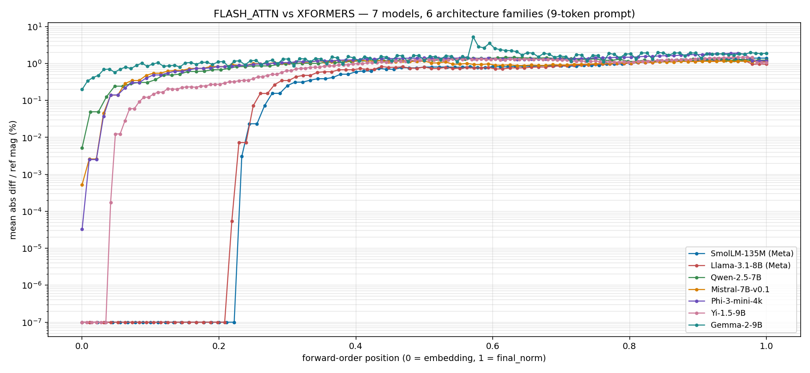
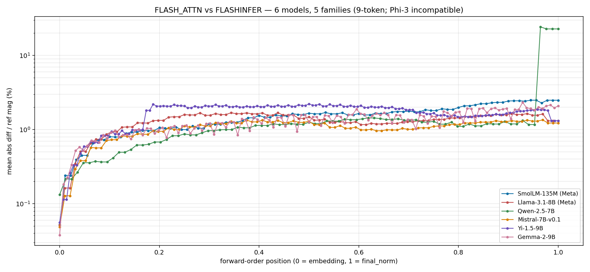

# What I found running per-layer activation diffs against vLLM

A few months ago I started building **[Firefly][repo]**, a small tool that
diffs a candidate ML model's per-layer activations against a calibrated
reference and tells you the first layer where they disagree. The intended
use case is a CI gate: you point it at your model on every PR and it
fails loud if the residual stream moves.

This post is about what fell out of running it against vLLM.

The most useful finding, before any setup:

> **vLLM 0.8.5 V0 → V1 is bit-equal at 9-token prompts and diverges at
> every single layer past the first PagedAttention block boundary**,
> with the *exact same attention kernel on both sides.* On
> Llama-3.1-8B, divergence saturates at ~2.8% final-layer relative
> error from 1k tokens through 4k tokens — it's a step function, not
> a slope. A unit test that uses short prompts would pass this
> comparison. Production would silently change.


The rest of this post is how I got here.

## What's Firefly

It's a CLI plus a GitHub Action wrapper. The model is:

1. Register **forward hooks** on every decoder layer's `self_attn`, `mlp`,
   and residual-stream outputs (plus `final_norm`). For a 30-layer model
   that's 91 "tap points."
2. Run the model on a fixed batch of golden inputs and stash each tap's
   output tensor to disk in a `weights.safetensors` + `manifest.json`
   reference dir. That's the **reference**.
3. To check a candidate, run the candidate against the same inputs, diff
   per-tap, and walk the results in forward order to attribute the
   *first* tap where the diff exceeds a calibrated tolerance. That's the
   "first divergence" — actionable in a way `eval_score = 0.87 → 0.83`
   isn't.

The architecture is intentionally boring. The capture, diff, and
attribution modules are pure functions; the orchestrators wrap them with
the model-loading and file-I/O. There's no online inference layer, no
hosted dashboard, no novel ML. The interesting part is the picks:

- **Hook at the module boundary, not inside.** vLLM and HF transformers
  both expose `model.layers[i].self_attn` as a top-level submodule. Even
  though their internals differ (vLLM fuses QKV into one Linear, HF keeps
  them separate), the module-level *output* is a tensor of the same
  shape. We tap there.
- **Calibrate the noise floor empirically.** Every tap gets its own
  tolerance derived from re-running the reference 8 times. Flat
  thresholds are wrong in both directions — too tight on noisy taps,
  too loose on quiet ones.
- **One forward-ordered list drives everything.** The tap selector
  returns layer 0's `self_attn`, then `mlp`, then layer 0 residual, then
  layer 1's `self_attn`, ... etc. The capture loop, the diff loop, and
  the first-divergence walk all iterate this same list. "First
  divergence" semantics fall out for free.

## The setup I tested against

Everything below is **SmolLM-135M in BF16 on an NVIDIA A10G**, prompt =
`"the quick brown fox jumps over the lazy dog"` unless noted. Captures
ran on Modal. vLLM 0.8.5 with `enforce_eager=True` (to keep forward
hooks working; CUDA graphs would skip them).

The reason for `enforce_eager=True` deserves a flag: in eager mode, hooks
work because every forward op is dispatched through the Python
interpreter. With CUDA graphs enabled — which is what production vLLM
actually runs — hooks would force graph breaks. That means **Firefly as
currently written is a CI-time diagnostic, not a shadow-mode capture
against live traffic**. For shadow mode you'd need a custom op
(`torch.ops.firefly.capture(tensor, name)`) that Dynamo treats as
opaque-but-tensor-in/tensor-out. That's a separate engineering arc.

## The matrix

I ran 7 paired comparisons across the standard vLLM knobs — version,
engine, attention backend, prompt length, decode mode, batch size. The
short summary:

| Comparison | Result |
|---|---|
| 0.7.3 V0 vs 0.8.5 V0, auto backend | bit-equal |
| 0.8.5 V0 vs V1, auto backend | bit-equal |
| 0.8.5 V0 vs V1, FLASH_ATTN | bit-equal |
| 0.8.5 V0, FLASH_ATTN vs XFORMERS | **diverges, first at `layer.7.self_attn`** |
| Multi-request, V0 vs V1 (2 prompts) | shape mismatch (V0 packs, V1 doesn't) |
| **V0 vs V1, FLASH_ATTN, 300 tokens** | **diverges at every tap, first at `layer.0.self_attn`** |
| FLASH_ATTN vs XFORMERS, 8 decode tokens | **diverges everywhere, first at `layer.0.self_attn@token_0`** |

Three of these are real findings worth unpacking.

## Finding 1: Different attention kernels → first divergence at `layer.7.self_attn`

Same model, same vLLM, same hardware, same prompt. Only difference:
`VLLM_ATTENTION_BACKEND=FLASH_ATTN` versus `XFORMERS`. Both are correct
implementations of scaled dot-product attention; they use different
reduction orders for the matmul.


Layers 0–6 are bit-equal. Then at layer 7, the divergence cuts in
sharply — `layer.7.self_attn` is the first non-zero tap, and from there
relative error climbs through the residual stream to 1.4% by the final
LayerNorm. The shape of the curve is the textbook
"compounding-rounding-error" pattern in a deep network.

The interesting part isn't *that* this happens — anyone who has worked
on numerical kernels expects different reduction orders to round
differently in low-precision. The interesting part is **why divergence
starts at layer 7 specifically, not layer 0.**

Both backends produce different intermediate values starting at layer 0.
But at low activation magnitudes (early layers), BF16's 7-bit mantissa
rounds those tiny differences to the same representable value. Around
layer 7 of SmolLM-135M, residual-stream magnitudes have grown enough
(this is the activation-magnitude phase transition Dettmers et al.
documented in [LLM.int8()][dettmers]) that the kernel-level differences
cross the BF16 representable threshold.

So "first divergence at layer 7" is really *"first layer where the
kernel-rounding difference exceeds the precision representable
threshold."* Firefly is correctly attributing to a *coupling of three
things* — kernel difference × activation magnitude × precision-format
floor.

I expected the boundary to move on a model with larger early-layer
activations. The next section is the experiment I ran to test that
prediction, and the result that made me rewrite this paragraph.

## Finding 1.5: The layer-7 finding survives 60× model scale within Meta — and breaks at the family boundary

I expected the layer-7 boundary to shift on a much bigger model, so I
ran two stress tests of Finding 1's mechanism:

**Within-family stress test (model scale).** Same comparison, swap the
model from SmolLM-135M to `meta-llama/Llama-3.1-8B` on an A100-40GB —
same vLLM 0.8.5 V0, same BF16, same 10-token prompt. **First divergence
held at `layer.7.self_attn` on a 60× larger model with a 7× wider
residual stream.** Same layer index, similar fraction of taps
diverging, similar overall curve shape:


|  | SmolLM-135M | Llama-3.1-8B |
| --- | --- | --- |
| first divergent tap | `layer.7.self_attn` | `layer.7.self_attn` |
| taps diverging | 70/91 (77%) | 76/97 (78%) |
| final-norm relative error | ~1.4% | ~0.96% |
| hidden dim | 576 | 4096 |
| layers | 30 | 32 |

I was about to declare the layer-7 boundary universal. But then the
cross-family check broke it.

**Cross-family stress test (5 more models).** Same comparison, swap
the model again — to `Qwen/Qwen2.5-7B`, `mistralai/Mistral-7B-v0.1`,
`microsoft/Phi-3-mini-4k-instruct`, `01-ai/Yi-1.5-9B`, and
`google/gemma-2-9b`. All ought to sit in the same "production-class"
regime as Llama-3.1-8B:



|  model | first divergent tap | layer-0 rel error | final-norm rel error |
| --- | --- | --- | --- |
| SmolLM-135M (Meta) | `layer.7.self_attn` | ~0% (bit-equal) | 1.4% |
| Llama-3.1-8B (Meta) | `layer.7.self_attn` | ~0% (bit-equal) | 0.96% |
| **Qwen-2.5-7B** | **`layer.0.self_attn`** | 0.0052% | 1.23% |
| **Mistral-7B-v0.1** | **`layer.0.self_attn`** | 0.0005% | 1.12% |
| **Phi-3-mini-4k** | **`layer.0.self_attn`** | ≈0.00005% | 1.18% |
| **Yi-1.5-9B** | **`layer.2.self_attn`** | ~0% (bit-equal) | 1.06% |
| **Gemma-2-9B** | **`layer.0.self_attn`** | **0.1979%** | **1.89%** |

Four things stand out:

1. **The layer-7 universality is real *within the Meta architecture
   lineage* (SmolLM, Llama-3) and breaks at every other family.**
   Qwen, Mistral, Phi-3, and Gemma-2 all shift to layer 0 with FLASH
   vs XFORMERS.
2. **Yi lands at layer 2** — neither 0 (the other 4 non-Meta models)
   nor 7 (Meta). So the pattern isn't even a clean "Meta-vs-not"
   dichotomy; it's per-family.
3. **Gemma-2's layer-0 rel error is the largest by ~40×** — 0.1979%
   vs Qwen's 0.0052%. Likely because Gemma-2 uses hybrid sliding-window
   + full attention, so XFORMERS and FLASH_ATTN dispatch through very
   different code paths even at the first attention layer.
4. **Final-norm relative errors fall in a 1.0%–1.9% band.** Where the
   divergence *starts* varies by family, but the *aggregate* drift by
   the final layer-norm doesn't.

The most likely driver of the family-level variation is a
vLLM-internal-dispatch effect. vLLM's XFORMERS backend takes different
code paths depending on the model's RoPE configuration — Llama-3.1
uses `theta=500000` with rope_scaling; Qwen2.5 uses `theta=1000000`;
Mistral uses `theta=10000`; Yi-1.5 uses a different rope_scaling
factor. Different inverse-frequency tables get computed and reduced
differently, and BF16 rounding surfaces the difference at the first
attention layer rather than waiting for activation magnitudes to grow.

**Corrected framing.** Finding 1's mechanism (kernel-diff × activation
magnitude × precision threshold) is the right intuition. The original
prediction "layer-7 will shift on larger models" was wrong about the
*scale* dimension and right about there being *some* model-dependent
dimension — I just had the wrong dimension in mind. The honest version
of the universality claim:

- **Within an architecture family** (Meta-Llama lineage tested):
  first-divergence layer is universal across model scale. Two
  data points (SmolLM-135M, Llama-3.1-8B); the layer-7 boundary
  is stable.
- **Across architecture families**: first-divergence layer
  shifts, and the shift isn't even uniform. Five more data points
  (Qwen-2.5, Mistral-7B, Phi-3-mini, Yi-1.5-9B, Gemma-2-9B); four
  land at layer 0, one (Yi) lands at layer 2.
- The *mechanism* of "Firefly's per-layer attribution points at the
  first BF16-visible difference" is unchanged. What that layer
  index *is* depends on the architecture-family-specific kernel
  dispatch.

That's a less ambitious universality claim than I led with, but it's
the claim the data actually supports. Forward-pointer: Finding 4 will
return to this with FLASHINFER, where the layer-0 finding turns out to
hold across *all five* models that can use FLASHINFER (one model can't,
for an architectural reason that's its own finding) — different kernel
pair, much more robust universality.

These next three findings still surprised me.

## Finding 2: Decode capture exposes that layer 0 itself diverges, via KV cache pollution

Same FLASH_ATTN vs XFORMERS comparison, but now I let the model generate
7 additional tokens after the prompt and captured activations at each
decode step. Tap names get suffixed: `layer.7.self_attn@prefill` for the
prompt forward, `layer.7.self_attn@token_0..token_6` for each decode
step.


Three things happen at once in this plot:

1. **Prefill (dark purple, bottom):** the familiar layer-7 onset story.
   Layers 0–6 bit-equal, sharp jump at 7, climbs to ~1.4% by
   `final_norm`. This is what we already had.

2. **token_0 (just above prefill):** *every layer* now diverges,
   including `layer.0.self_attn`. The prompt-time KV cache that
   layer 0's decode-step attention reads from already contains
   diverged tail-layer values from prefill. There is no
   "layer 0 starts clean" regime at decode time.

3. **token_1 through token_6 (stacked progressively higher):** each
   successive curve sits above the last. The KV cache lengthens with
   every generated token and accumulates more diverged outputs, so each
   new token's forward computation reads from a *progressively more
   polluted* cache. By token 6, `final_norm` is at 3.7% relative error,
   up from 1.4% at prefill.

In forward order with the unified tap naming (prefill first, then
token_0, token_1, ... per tap), the *first* divergent tap is
**`layer.0.self_attn@token_0`**, not `layer.7.self_attn` as it is in
prefill-only mode. The KV cache propagation makes layer 0 itself the
entry point of divergence at decode time.

This destroys the "output-level monitoring will eventually catch it"
argument that ML observability vendors lean on. The final-LayerNorm
rescales by ~50× by the end of the network — output drift is *small
percent-of-scale*. An eval that thresholds at 1% accuracy delta passes
this comparison at token 0 and might keep passing for 50 tokens before
the accumulated drift crosses the threshold.

## Finding 3: The same engine swap that's safe at 9 tokens is broken at 1k — and stays broken

This is the load-bearing finding. The plot at the top of the post.

Same vLLM 0.8.5. Same FLASH_ATTN. Only difference: the V0 engine vs the
V1 engine. I ran the comparison at four prompt lengths on
Llama-3.1-8B (A100-40GB, BF16):

| prompt length | taps diverging | first divergence | final-norm rel error |
| --- | --- | --- | --- |
| 9 tokens | **0 / 97** (bit-equal) | — | 0% |
| 1k tokens | 97 / 97 | `layer.0.self_attn` | **2.84%** |
| 2k tokens | 97 / 97 | `layer.0.self_attn` | **2.62%** |
| 4k tokens | 97 / 97 | `layer.0.self_attn` | **2.86%** |

I expected "monotonically growing with length." That's *not* what
happens. **The curve is a step function**: bit-equal at very short
prompts, immediately maxed-out divergence past the first PagedAttention
block boundary, and roughly flat from 1k tokens onward. Length isn't
the threshold; block-count is.

Why? V0 uses flat attention — compute the full $QK^T \to \text{softmax}
\to V$ product in one go. V1 uses PagedAttention, which is vLLM's
marquee feature: the KV cache is sharded into 16-token blocks, attention
is computed block-by-block, and an online-softmax merge stitches the
per-block scores back together. The math is *equivalent*. The reduction
order is *different*. BF16 makes the difference visible.

At 9 tokens, only one block is involved. Single-block PagedAttention is
arithmetically identical to flat attention — same reduction order, same
bit pattern. At 1k tokens, 60+ block boundaries are crossed and the
online-softmax merge has accumulated enough rounding error that *every*
tap is past tolerance. Crossing from 1k to 4k adds more block
boundaries but the per-element error from the merge is already
saturated.

The implication for the product story is:

- **Short-prompt unit tests pass.** Anyone testing their vLLM upgrade
  with the typical 8-to-30-token prompts you find in test fixtures
  would see "V0 → V1 is bit-equal" and call the upgrade safe.
- **Any realistic production prompt is in the divergent regime.** 1k
  tokens is below most production prompt lengths. Whatever length you
  test at past the block boundary, you see the same ~2.8% final-norm
  drift.
- **The kernel is literally identical.** This is not a kernel-swap bug;
  it's a *blocking strategy* bug. The argument "FLASH_ATTN on V0 and
  FLASH_ATTN on V1 are doing the same math" turns out to be true only
  at trivially-short context — below the block-boundary threshold.

This is the finding I'd want a CI gate to catch — quietly,
automatically, before deploy. A short-prompt unit test would not. A
benchmark eval might or might not, depending on how sensitive the eval
metric is to ~3% absolute internal drift that final_norm rescales down.

## Finding 4: FLASHINFER diverges at layer 0 — and its error grows with length

vLLM ships three attention backends — FLASH_ATTN, XFORMERS, and
FLASHINFER. FLASHINFER is the one production stacks at Together,
Fireworks, and DeepSeek actually use, because its split-K
parallelization beats FlashAttention 2 for single-query decode.
Getting it installed on Modal was annoying — `flashinfer-python` on
PyPI is a stub requiring a CUDA-specific wheel; attempts on
`debian_slim` failed with "CUDA_HOME not set", on the
`vllm/vllm-openai` Docker image with a Python 3.12 aiohttp ABI
collision, and finally worked on a clean `nvidia/cuda` devel base
with explicit pip-install of vLLM and flashinfer.

Once it was working, the result:


| length | first divergent tap | layer-0 rel | final-norm rel |
| --- | --- | --- | --- |
| 9 tokens | `layer.0.self_attn` | 0.0516% | 1.31% |
| 1k tokens | `layer.0.self_attn` | 0.0749% | 3.29% |
| 2k tokens | `layer.0.self_attn` | 0.0722% | **2.92%** |
| 4k tokens | `layer.0.self_attn` | 0.0693% | **2.96%** |

Two new things relative to the earlier findings:

**1. Layer 0, not layer 7 — and this one really is universal across
families.** The FLASHINFER vs FLASH_ATTN per-element kernel-difference
is much larger than XFORMERS vs FLASH_ATTN's: ~0.05% relative at layer
0 versus ~0.0001% at layer 0 for XFORMERS. The bigger per-element diff
crosses BF16's representable threshold *immediately* in early-layer
activations. In contrast to the XFORMERS layer-7 finding that broke at
the family boundary, the FLASHINFER layer-0 finding holds across all
six models I tested that can run FLASHINFER — covering Meta, Qwen,
Mistral, 01.AI, and Google architecture lineages:



| model | first divergent tap | layer-0 rel | final-norm rel |
| --- | --- | --- | --- |
| SmolLM-135M (Meta) | `layer.0.self_attn` | 0.0519% | 2.49% |
| Llama-3.1-8B (Meta) | `layer.0.self_attn` | 0.0516% | 1.31% |
| Qwen-2.5-7B | `layer.0.self_attn` | 0.1332% | **22.83%** |
| Mistral-7B-v0.1 | `layer.0.self_attn` | 0.0489% | 1.23% |
| Yi-1.5-9B | `layer.0.self_attn` | 0.0562% | 1.32% |
| Gemma-2-9B | `layer.0.self_attn` | 0.0380% | 2.09% |

So the kernel-pair-determines-the-divergence-layer story has *some*
universal claims and some less-universal ones. FLASHINFER's per-element
diff is large enough to cross the BF16 threshold at layer 0 regardless
of family-specific dispatch differences; XFORMERS's smaller per-element
diff is sensitive to those differences.

The Qwen final-norm number (22.83%) is a 20× outlier vs the other five
models. That's not the universal story — that's its own finding, and
Finding 5 below unpacks it.

**A separate FLASHINFER finding worth flagging.** When I tried to run
the same comparison on Microsoft's `Phi-3-mini-4k-instruct`, vLLM
init failed before any forward pass:

```
ValueError: Only [64, 128, 256] are supported for head_dim, received 96.
```

Phi-3-mini uses `head_dim=96`, which FLASHINFER's kernels don't
support. **FLASHINFER isn't a drop-in replacement for every supported
vLLM model**, regardless of numerical drift. For a production stack
that needs to serve Phi-3-class architectures, this constraint is more
load-bearing than the layer-0 numerical drift finding.

**2. The length curve is *also* a step-up-then-plateau, just at a
higher plateau than V0 vs V1.** I initially thought FLASHINFER's
length curve was monotonic (the original 9 → 1k jump was 2.5×, which
read like growth in progress). Adding 2k and 4k tokens shows the
plateau: 1k = 3.29%, 2k = 2.92%, 4k = 2.96%. The 1k number is even
slightly higher than 2k and 4k — measurement noise within the
saturated regime, not a trend.

So both length curves saturate past ~1k tokens — they just saturate
at different *heights*:

| | 9 tokens | 1k+ plateau |
| --- | --- | --- |
| V0 vs V1, same FLASH_ATTN | bit-equal | ~2.8% |
| FLASH_ATTN vs FLASHINFER | **1.31%** | **~3.0%** |

The explanation matches: FLASHINFER has two superimposed sources of
difference:

- A constant kernel-level reduction-order diff (visible at 9 tokens,
  baseline ~1.3% final). V0 vs V1 doesn't have this — same kernel.
- A length-dependent paging diff that compounds once you cross the
  first PagedAttention block boundary, then saturates because the
  per-block error doesn't keep compounding to first order. This is
  the same mechanism V0 vs V1 has, at the same plateau height
  (~1.6-1.7% of additional final-norm rel).

**Synthesis.** Firefly's per-layer attribution distinguishes three
distinct failure modes that all look like "model output drifted" at
the eval level:

| failure mode | example | first divergent tap | length curve |
| --- | --- | --- | --- |
| kernel reduction-order (small) | FLASH vs XFORMERS | `layer.7.self_attn` (Meta) / `layer.0` or `layer.2` (others) | unknown |
| kernel reduction-order (large) | FLASH vs FLASHINFER | `layer.0.self_attn` | step-up to ~3% then plateau |
| blocking strategy | V0 vs V1, same kernel | bit-equal short, `layer.0.self_attn` long | step-up to ~2.8% then plateau |

Same attribution tool, three different signatures. Useful in
production: an SRE seeing "Firefly says first divergence is
layer.0.self_attn and the rel error grew between 1k and 4k" knows the
kernel itself changed; "first divergence is layer.7" knows it's a
subtler kernel swap; "bit-equal at short and divergent at long" knows
it's a blocking-strategy change.

## Finding 5: Qwen-2.5-7B + FLASHINFER has a 20× catastrophic divergence at the final layer

The Qwen final-norm 22.83% number from Finding 4 is *not* a
distributed-everywhere-large-error situation. It's a single-layer
catastrophic spike. Through layers 0-26, Qwen FLASHINFER vs FLASH_ATTN
tracks the other three models — gradually climbing from ~0.13% at
layer 0 to ~1.2% by layer 26, almost identical to Mistral's curve.
Then layer 27 happens:

| layer | Qwen rel error | Qwen `mean(\|activation\|)` |
| --- | --- | --- |
| 26 | 1.17% | 0.526 |
| **27.self_attn** | **24.31%** | **0.989** |
| **27.mlp** | **22.83%** | **2.066** |
| final_norm | 22.83% | 2.066 |

A 20× jump in relative error in one layer. Qwen-2.5-7B has 28 layers
(indexed 0-27), so layer 27 is its *final transformer block*. Mistral
(32 layers, last index 31) has no analogous jump — its final layer
sits at 1.35%. So this is not "last layer of anything" — it's
specifically Qwen.

Looking at the activation magnitudes plot for Qwen:


Qwen's MLP outputs peak at a `max(|activation|)` of **252** — the
largest outlier-feature magnitudes in any model I tested (Llama tops
out at 40, SmolLM at 13). Crucially, the concentration is in the
*late* layers. Mistral has similar peak magnitudes (~176), but they
ramp up gradually across 32 layers; Qwen front-loads its outliers into
the final 1-2 layers.

The interaction is plausibly: FLASHINFER's larger per-element
reduction-order difference (visible from layer 0) compounds gradually
through the network. At Qwen's layer 27, where the activation
magnitudes jump 4× from layer 26, the per-element diff suddenly has 4×
more headroom to manifest in absolute terms — and the relative error
spikes 20×.

This is the kind of finding a Qwen-on-FLASHINFER serving stack would
want to know about. The model's output drift in BF16 with FLASHINFER
is a specific, localized, mechanistic issue concentrated in one layer
— not a broad model-wide degradation. An eval that looks at
final-output similarity would say "Qwen on FLASHINFER is meaningfully
different from Qwen on FLASH_ATTN" with no further attribution.
Firefly's per-layer attribution localizes it to `layer.27` and shows
its mechanism (magnitude × kernel-diff overshoot) in one plot.

Re-running the Qwen FLASHINFER capture from scratch produces
bit-identical per-tap activations and the same 22.83% final-norm
number to four decimal places — Firefly's deterministic capture path
makes the result a stable diagnostic, not a noisy measurement. And
the catastrophic spike is *Qwen-specific*: Mistral-7B and Yi-1.5-9B
both have similar peak activation magnitudes but no final-layer
spike, because they spread their outlier features across more layers
rather than concentrating them in the final 1-2.

I haven't tried to file this with vLLM or with FlashInfer upstream
because I'm not certain it's a *bug* — it might be the BF16-correct
behavior given Qwen's outlier-feature concentration at the final
layer. But it's a reproducible, attributable, *production-relevant*
numerical divergence, and the diagnostic flow it took to surface it
(swap one knob, run one Firefly check, look at the per-layer curve)
is exactly the workflow this tool is for.

## What I think this means for ML CI

A few unromantic takeaways:

**Numerical-parity testing is real, and the real failure mode is the
boring one.** I was hoping to find dramatic bugs: a quantization kernel
returning NaN, a kernel that off-by-ones at a boundary, a regression
shipped by accident. What I found instead was *correct code with
different reduction orders.* The vLLM team isn't doing anything wrong.
Their engine rewrite is mathematically equivalent. Their kernel swap is
mathematically equivalent. The numerical-parity failures come from
"mathematically equivalent" not being the same thing as "bit-identical
in low precision."

**Tolerance calibration is environment-sensitive.** Same-machine
calibration measures runs-on-this-machine variance; cross-machine FP
variation is a different (and often larger) noise distribution. I
discovered this the hard way when the first GitHub Actions run of
Firefly's own demo lit up like a Christmas tree because I'd calibrated
on Apple Silicon and the Action ran on x86 Ubuntu. The fix in the
product is a `--max-rel-error` ceiling that composes with the per-tap
calibration. The lesson: "calibrated tolerances" alone aren't portable;
they need an environment-stationarity escape hatch.

**Per-layer attribution earns its keep.** "Your eval dropped 2 points"
sends a developer on a multi-hour fishing expedition through git blame.
"`layer.7.self_attn` is the first divergent tap" points directly at the
attention kernel. The cost of producing this attribution is N forward
hooks and a sort — trivially cheap. The cost of *not* producing it
shows up every time someone debugs a serving-stack regression.

**Decode-step capture changes the story.** Prefill-only is the easy
case. Decode is where the production knobs (PagedAttention, scheduler,
spec decode) actually live, and it's where divergence compounds via KV
cache. If you're going to build numerical-parity tooling for LLM
inference, decode capture is the part that matters; prefill-only tools
will miss most real upgrade-time bugs.

## Limitations I should flag

- **Seven models, six architecture families.** SmolLM-135M and
  Llama-3.1-8B (Meta lineage), Qwen-2.5-7B, Mistral-7B-v0.1,
  Phi-3-mini-4k, Yi-1.5-9B, Gemma-2-9B. The XFORMERS layer-7
  universality from Finding 1.5 is within-Meta only; non-Meta is
  layer 0 on 4 of 5 (Qwen, Mistral, Phi-3, Gemma-2) with Yi as the
  outlier at layer 2. FLASHINFER's layer-0 universality from
  Finding 4 holds across all six models that support FLASHINFER
  (Phi-3 doesn't, head_dim=96).
- **One precision format primarily.** Most of my runs are BF16; the
  earlier validation work showed FP32 is bit-deterministic on the same
  setup, and FP16 behaves like BF16 from a reproducibility standpoint
  (different mantissa, same general pattern). Quantized regimes
  (INT8/INT4) would surface different failure modes.
- **One inference engine.** Firefly currently has a vLLM-specific
  capture path. SGLang and TGI would each need their own. The engine-
  internal differences (apply_model vs collective_rpc, etc.) are the
  per-engine engineering cost.
- **Eager mode only.** As noted, hooks can't survive CUDA graphs, so
  Firefly today is a CI-time tool. Shadow-mode capture against live
  traffic would require a custom op. That's the v3 line item.

## Reproduce

The full repo is at **[github.com/neelvad/firefly][repo]**. To rerun the
matrix locally:

```sh
git clone https://github.com/neelvad/firefly && cd firefly
uv sync --all-extras
uv run python scripts/run_vllm_suite.py
```

The reference dirs for the V0/V1/FLASH_ATTN/XFORMERS combinations
referenced here aren't in the repo (they need a GPU to produce), but
`scripts/capture_vllm.py` is the script that produced each one and the
test suite YAML at `scripts/vllm_test_suite.yml` declares each
(reference_a, reference_b, expected) tuple so you can regenerate them.

The headline length-curve comparison is eight commands on Modal
A100-40GB, ~$2–5 total. A single 9-token + 1k pair is enough to see
the step-function behavior if you want to skip 2k / 4k:

```sh
# 9-token bit-equal baseline
uv run modal run scripts/capture_vllm.py \
  --vllm-tag 0.8.5 --engine v0 --attention-backend FLASH_ATTN \
  --model meta-llama/Llama-3.1-8B --gpu A100-40GB --gpu-memory-utilization 0.7 \
  --out llama_v0_flash_short

uv run modal run scripts/capture_vllm.py \
  --vllm-tag 0.8.5 --engine v1 --attention-backend FLASH_ATTN \
  --model meta-llama/Llama-3.1-8B --gpu A100-40GB --gpu-memory-utilization 0.7 \
  --out llama_v1_flash_short

# 1k-token divergent regime
uv run modal run scripts/capture_vllm.py \
  --vllm-tag 0.8.5 --engine v0 --attention-backend FLASH_ATTN \
  --model meta-llama/Llama-3.1-8B --gpu A100-40GB --gpu-memory-utilization 0.7 \
  --prompt-file scripts/prompts/long_1k.txt --max-seq-len 1100 \
  --out llama_v0_flash_long1k

uv run modal run scripts/capture_vllm.py \
  --vllm-tag 0.8.5 --engine v1 --attention-backend FLASH_ATTN \
  --model meta-llama/Llama-3.1-8B --gpu A100-40GB --gpu-memory-utilization 0.7 \
  --prompt-file scripts/prompts/long_1k.txt --max-seq-len 1100 \
  --out llama_v1_flash_long1k
```

`uv run python scripts/plot_validation.py diff scripts/results/llama_v0_flash_long1k scripts/results/llama_v1_flash_long1k` produces the per-tap curve at 1k tokens. The full overlay (9 / 1k / 2k / 4k on one chart) needs the 2k and 4k pairs as well; swap the prompt file and `--max-seq-len` accordingly.

## What's next

1. **Why exactly does Qwen layer 27 spike with FLASHINFER and not with
   FLASH_ATTN?** Finding 5 establishes the *what*; the mechanism is
   plausibly "outlier-feature magnitudes × FLASHINFER's reduction
   order at the final layer" but I haven't isolated which specific
   FLASHINFER kernel call diverges. A focused investigation would
   compare per-head attention outputs at Qwen layer 27 — Firefly's
   hook infrastructure already supports it, just needs an extra
   tap-point selector.

2. **More cross-family models.** Phi-3, Yi, and Gemma-2 added in
   this pass. The remaining gaps are non-GQA architectures (Falcon),
   non-Llama-style positional encodings (e.g., ALiBi), and very small
   non-Llama models (Pythia, etc.). Each new family is a cheap
   data point (~$1 of Modal time) once the model's HF gate is
   accepted.

3. **Does the Yi `layer.2` first-divergence reproduce or shift on
   Yi-1.5-34B?** Yi being the lone "layer 2" data point — neither
   the layer 0 of Qwen/Mistral/Phi-3 nor the layer 7 of Meta — is
   suspicious. Either Yi has a unique RoPE handling quirk that
   produces this exact onset, or the layer 2 number is a one-off
   that would shift on a larger Yi model.

If you've hit numerical-regression bugs in serving stacks and want to
compare notes, or if you'd find Firefly useful for your own CI and want
to talk about what's missing, I'm at **neel.vadoothker@gmail.com**.

[repo]: https://github.com/neelvad/firefly
[dettmers]: https://arxiv.org/abs/2208.07339
