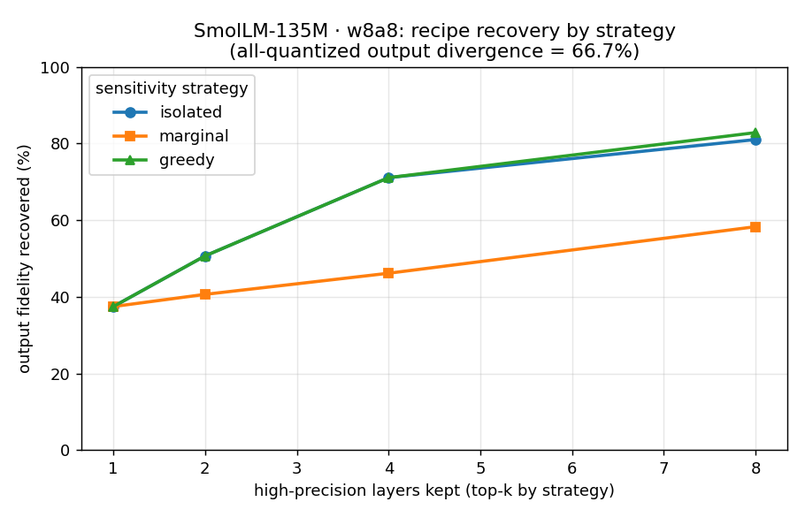

# Which layers should you keep in high precision?

[Firefly][repo] started as a CI gate that diffs a model's per-layer activations
against a reference. The same machinery answers a question quantization people
actually have: **when int8/int4 hurts my model, *which layers* are responsible,
and what do I keep in high precision to get the quality back?**

`torchao`'s `autoquant` searches for a fast config that clears a tolerance, but
when it doesn't, it can't tell you *why* or *what to try next*. Firefly measures
the cause directly.

## The mechanism

For each decoder layer, quantize **only that layer** (everything else stays fp)
with real torchao kernels, and measure the resulting divergence at the model's
output. That ranks layers by how much their quantization hurts. Then **build and
verify a recipe**: keep the top-k most-sensitive layers in high precision,
quantize the rest, and measure how much of the degradation you actually recover.

Nothing here is predicted from a proxy — every number is a measured forward pass.

## This is a feature-selection problem

Choosing which layers to keep in high precision is, structurally, **subset
selection**: a set of "features" (layers), and you pick which to keep fp to
minimize quality loss under a budget. (The general K-bit version is categorical
per layer — a knapsack/bit-allocation problem — but the keep-fp-vs-quantize case
is exactly binary subset selection.) That maps the methods people use onto the
classic feature-selection taxonomy:

- **Filter** (cheap per-item score, then threshold) → per-layer **sensitivity
  ranking**. Our `isolated`/`marginal`; HAWQ's Hessian-trace sensitivity; AWQ's
  activation salience.
- **Wrapper** (evaluate subsets by running the model) → **search**. Our
  `greedy` (sequential forward selection); HAQ's RL bit-allocation.
- **Embedded** (learned during training) → learnable bit-widths (DNAS, QAT).

And the reason wrapper methods beat filter methods in feature selection —
**interactions / non-additivity** — is exactly what shows up here.

## Three strategies, measured head to head

How you choose the keep-set is a pluggable strategy:

- **isolated** (filter) — quantize *only* layer `i`; rank by the divergence it
  causes alone. Surfaces the *intrinsically* hard-to-quantize layers.
- **marginal** (filter) — quantize *all but* layer `i`; rank by how much keeping
  it fp *recovers*. The seemingly more decision-relevant signal.
- **greedy** (wrapper) — sequential forward selection: add the layer that most
  reduces divergence *given what's already kept*, re-measure, repeat. More
  measurements; accounts for interactions.



On SmolLM-135M / W8A8, quantizing all 30 layers moves the output **66.7%**. All
three agree the single worst layer is `layer.28` (the model's massive-activation
layer) — keeping it alone recovers 37%. After that:

- **marginal** is the surprise loser — top-4 recovers only **46%**. It measures
  each layer's recovery in a context where *everything else is still quantized*,
  so it favors early layers whose recovery doesn't transfer to a multi-layer
  recipe.
- **isolated** recovers **71%** at top-4 — its intrinsic-difficulty ranking
  picks the late outlier layers that actually matter together.
- **greedy** is provably ≥ both and beats marginal clearly, but here it only
  *ties* isolated through k=4 and edges it at k=8 (**82.8% vs 81.0%**).

The interesting part is *why greedy barely beats isolated*: `layer.28` dominates
so heavily that the interactions are weak, so the cheap filter (`isolated`)
lands on essentially the greedy-optimal set.

## When interactions matter: int4 on a bigger model

Re-run on **Qwen2.5-0.5B with int4 weight-only** (a more aggressive scheme, on
a model with no single dominating layer; all-quantized divergence **72.7%**) and
the picture changes — recovery (%) by strategy:

| keep k | isolated | marginal | greedy |
| ---: | ---: | ---: | ---: |
| 1 | 3.0 | **6.9** | **6.9** |
| 2 | 10.4 | 10.1 | 10.4 |
| 4 | **33.0** | 15.6 | **33.0** |
| 8 | 46.9 | 22.8 | **48.4** |

Now **neither filter is robust**: `marginal` wins at k=1 (no dominating layer, so
"what recovers most" beats "intrinsic difficulty"), but `isolated` wins by k=4.
**`greedy` is the only strategy that's best-or-tied at every k** — it's
effectively `max(isolated, marginal)` plus an edge at k=8. That's the
wrapper-beats-filter payoff the feature-selection analogy predicts, and it only
shows up once interactions matter.

So the practical rule is the feature-selection rule: **use a cheap filter when
one unit dominates; spend the wrapper (greedy) compute when sensitivity is
distributed.** (Validated on real int4 kernels on GPU via
`scripts/validate_quant_recipe_gpu.py`.)

## Granularity: layer vs Linear

The keep-or-quantize *unit* is also a knob (`--granularity`). By default it's a
whole decoder layer (its 7 Linears together). At `--granularity linear`, each
`nn.Linear` is its own unit — finer recipes at ~7x the units (and ~7² the greedy
compute). On SmolLM-135M, going per-Linear sharpens the diagnosis: the most
quant-sensitive units are specifically the **MLP projections** of the late
layers (`layer.28.mlp.up_proj` tops it; attention barely registers). So you can
keep just a couple of Linears in fp rather than whole layers — cheaper for the
same recovery. (This is the same drill-down ladder as the parity tool's
layer→head attribution; the floor for *quant* recipes is the Linear.)

## Gate on a real eval: the accuracy bar

Everything above optimizes a *surrogate* — output divergence vs the fp baseline
on the calibration prompts. That ranks layers well, but it isn't what you ship
against. The product question is: **"give me the smallest recipe whose real
metric stays within X of fp on my eval set."** That's `--accuracy-bar`:

```sh
firefly quant-recipe -m HuggingFaceTB/SmolLM-135M -i calib.json \
    --scheme w8a8 --accuracy-bar rel:0.05 \
    --eval eval.jsonl --metric perplexity
```

```
perplexity (↓ lower better)  fp baseline 41.42 → all-w8a8 47.01   (bar 5.0% rel → threshold 43.49)
┏━━━━━━━━━━━━━━┳━━━━━━━━━━━━┳━━━━━━━━━━━━━┓
┃ keep hi-prec ┃ perplexity ┃ within bar? ┃
┡━━━━━━━━━━━━━━╇━━━━━━━━━━━━╇━━━━━━━━━━━━━┩
│         0/30 │      47.01 │     no      │
│         1/30 │      43.86 │     no      │
│         2/30 │      43.45 │     yes     │   ← chosen
│         7/30 │      38.98 │     yes     │
│        15/30 │      38.62 │     yes     │
│        30/30 │      41.42 │     yes     │
└──────────────┴────────────┴─────────────┘
recipe: keep 2/30 layers in high precision → perplexity 43.45 (threshold 43.49).  kept: layer.28, layer.29
7 real evals spent (binary search + baseline + floor).
```

The win is the **two-tier metric**. The cheap proxy ranks all 30 layers (one
forward each — the *filter*); the expensive real eval is spent only to *gate*
candidate recipes, and a binary search over the ranking finds the smallest
passing keep-set in ~log₂(N) evals (the *wrapper*). Here it kept just the two
late massive-activation layers (`layer.28`, `layer.29`) in fp and quantized the
other 28 — at the cost of **7 evals, not 30**.

The metric is pluggable: `--metric perplexity` (built-in) or a
`module:function` callable taking `(model, tokenizer) → float` (carry a
`higher_is_better = False` attribute for a loss-style metric). The bar is
`rel:<frac>` (within X% of baseline) or `abs:<delta>` (absolute metric units),
and the direction is handled for you — a floor below baseline for accuracy, a
ceiling above it for perplexity.

One honesty note visible in the table above: the recovery curve is **not
strictly monotonic** — keeping 15 layers fp (perplexity 38.62) actually beats
*full* fp (41.42) on this tiny eval, because partial quantization can act as
mild regularization. The binary search assumes monotonicity to stay cheap, so it
returns the smallest *confirmed-passing* recipe rather than a proof of global
minimality; for a CI gate that's the right trade. (This is the verification
substrate the planned agent-in-the-loop "agentic quantization" sits on top of:
every proposed intervention is gated by a real, cheap-to-verify eval.)

## Cost, and the Pareto frontier

A recipe has two numbers that matter, and they trade off: **quality** (perplexity
/ divergence) and **cost** (weight memory). Keeping more layers in fp buys
quality but costs bytes; quantizing more is cheaper but worse. So Firefly attaches
an exact memory cost to every recipe — the quantizable Linears at their actual
precision (base dtype for kept units, scheme bits for the rest; int4wo's group
scales included) — and reports the trade-off, not a single number.

The organizing idea is **domination**: recipe A dominates B if A is no worse on
*both* size and quality and strictly better on one — nobody rational picks B. The
**Pareto frontier** is the set nobody dominates, and it's where the accuracy-bar
table earns the `Pareto` column:

```
perplexity (↓ lower better)  fp baseline 41.42 → all-w8a8 47.01   (bar 5.0% rel → threshold 43.49)
weight footprint: all-fp 424.7 MB → all-w8a8 106.2 MB (4.0× smaller)
┏━━━━━━━━━━━━━━┳━━━━━━━━━━━━┳━━━━━━━━━━┳━━━━━━━━━━━━━┳━━━━━━━━━━┓
┃ keep hi-prec ┃ perplexity ┃   memory ┃ within bar? ┃  Pareto  ┃
┡━━━━━━━━━━━━━━╇━━━━━━━━━━━━╇━━━━━━━━━━╇━━━━━━━━━━━━━╇━━━━━━━━━━┩
│         0/30 │      47.01 │ 106.2 MB │     no      │ frontier │
│         2/30 │      43.45 │ 127.4 MB │     yes     │ frontier │   ← chosen (cheapest in-bar)
│         3/30 │      40.58 │ 138.0 MB │     yes     │   knee   │
│        15/30 │      38.62 │ 265.4 MB │     yes     │ frontier │
│        30/30 │      41.42 │ 424.7 MB │     yes     │          │   ← DOMINATED
└──────────────┴────────────┴──────────┴─────────────┴──────────┘
```

The headline is the last row: **full fp (30/30) is not on the frontier.** Keeping
15 layers gives *lower* perplexity (38.62 vs 41.42) at *less* memory (265 vs 425
MB) — partial quantization acted as mild regularization here, so shipping the full
fp model would be strictly wasteful. A recovery *curve* indexed by k can't show
that; the frontier, indexed by actual cost, drops it automatically.

Three ways to read a point off the frontier:

- **the accuracy bar** picks the cheapest recipe that clears your quality
  threshold (here: keep 2 layers, 3.3× smaller than fp);
- **the knee** (`knee` row) is the best quality-per-byte before diminishing
  returns — the natural default when you don't have a hard bar;
- **anything not marked** is dominated — never the right choice.

## Budgeting the search

The expensive part is the measurements (a deepcopy + quantize + forward each), and
the count is **known a priori** from `#units × strategy × k` — so `--max-measurements`
caps it *before* anything runs:

```sh
$ firefly quant-recipe ... --strategy greedy --granularity linear --max-measurements 50
estimated 1653 measurements (over 210 units) exceeds --max-measurements 50.
Use a coarser --granularity, fewer --k-values, or raise --max-measurements.
```

That guard is what stops an accidental O(N·k) greedy-on-Linears run (1653 forwards
here) from starting unannounced on a real model.

## Beyond keep-fp: interventions (SmoothQuant)

Mixed precision is the *coarse* lever — keep a whole layer in fp. But many quant
failures have a *targeted* fix that doesn't cost any fp layers. The most common
is **activation outliers**: a few input-channel activations are huge, so per-token
int8 activation quant sets its scale from them and crushes every other channel.
The right treatment isn't "keep the layer fp" — it's **SmoothQuant**, which uses
the identity `Y = X·Wᵀ = (X/s)·(s·W)ᵀ` to migrate the outlier magnitude from the
activations into the weights (which quantize fine). Same output, both tensors now
easy to quantize.

Firefly applies it as a **pre-transform** in front of the quantizer (`--smoothquant`),
calibrated on `--inputs`:

```sh
firefly quant-recipe -m HuggingFaceTB/SmolLM-135M -i calib.json \
    --scheme w8a8 --smoothquant ...
```

On SmolLM-135M / w8a8 the effect is dramatic — and reproduces on CPU:

| | output divergence vs fp |
| --- | ---: |
| plain w8a8 (all layers) | **66.7%** |
| w8a8 + SmoothQuant | **8.5%** |

An **87% recovery with zero fp layers kept** — a different axis from mixed
precision, and they compose (smooth first, then keep the few layers SmoothQuant
can't rescue). This is the first technique to plug into Firefly's *intervention
seam*: a stable `apply(model, policy, calib) → model'` interface where each
technique is a thin adapter, ordered by stage (pre-transforms, then the
quantizer). SmoothQuant's core is simple enough to own (~50 lines of per-channel
rescale); GPTQ/AWQ will be wrapped from their libraries against the same
interface. The attribution decides *which* failure mode you have; the seam lets
the matching treatment slot in.

## Diagnosis: connecting the measurement to the treatment

The seam (above) is the *actuator*; the missing half was the *sensor* — something
that reads the measurements and says *which* failure mode this model has.
`firefly quant-diagnose` is that sensor. It runs on the stored activations (no
model run) and emits a **measured, causal** diagnosis routed to the intervention
that treats it:

```
$ firefly quant-diagnose -r reference/
Firefly quant diagnosis — 3 finding(s)
  activation_outliers @ layer.29.mlp → smoothquant
    layer.29.mlp: int8 per-tensor error 34% is dominated by outlier channels (70x
    concentration) — per-channel rescues it to 0.4% (84x). SmoothQuant migrates those
    outliers into the weights so per-token activation quant stops crushing the rest;
    apply --smoothquant and verify against an --accuracy-bar.
verify: firefly quant-recipe -m <model> -i <inputs> --smoothquant --accuracy-bar rel:0.01 ...
```

That explanation is the thing autoquant can't give: not "your eval dropped," but
*"this layer's int8 error is a few outlier channels, here's the technique that
moves them, go verify it."* The loop is **diagnose → route → `optimize_to_bar`
verifies → explain from the measured before/after** — deterministic and fully
measured (no LLM).

**Honest coverage — this is the important part.** `quant-diagnose` only emits
signatures it can actually detect from the activation-capture substrate:

- **activation-outliers** (→ SmoothQuant) — from quant-risk's `channel_concentration`.
- **single-unit-dominance** (→ mixed precision) — from a sensitivity sweep where one
  unit's quant sensitivity dwarfs the rest.

It deliberately does **not** ship labels for failure modes it can't measure. AWQ's
salient-weight-channel signal would need a new weight-side sensor (`|W|·|X|` per
channel — buildable, not built); GPTQ's case is justified in weight-space (the
Hessian), which a forward pass can't observe. A *general* "agent picks the next
technique" loop runs into a second wall too — the technique axis isn't monotone
(SmoothQuant changes AWQ's salience, can help or hurt GPTQ), so the cheap
keep-set binary search doesn't transfer; each technique combination is a full
re-quant + re-eval. So Firefly's quant agent is, honestly, a **diagnosis-routed
recipe selector** for the failure modes it can detect — the search only tunes the
(monotone) keep-set inside the chosen template. That's the half that's both
viable and differentiated; the autonomous technique-search agent is not claimed.

## Reproduce it

```sh
# the comparison plot above (CPU, ~20s):
uv run python scripts/demo_quant_recipe.py

# rank layers by sensitivity:
firefly quant-sensitivity -m HuggingFaceTB/SmolLM-135M -i golden.json --scheme w8a8

# build + verify a recipe (try --strategy isolated | marginal | greedy):
firefly quant-recipe -m HuggingFaceTB/SmolLM-135M -i golden.json \
    --scheme w8a8 --strategy greedy --k-values 1,2,4,8

# or gate on a real eval metric instead of the divergence proxy:
firefly quant-recipe -m HuggingFaceTB/SmolLM-135M -i golden.json \
    --scheme w8a8 --accuracy-bar rel:0.05 --eval eval.jsonl --metric perplexity
```

`--scheme int4wo` runs the same thing for int4 weight-only (needs a CUDA GPU).

[repo]: https://github.com/neelvad/firefly
